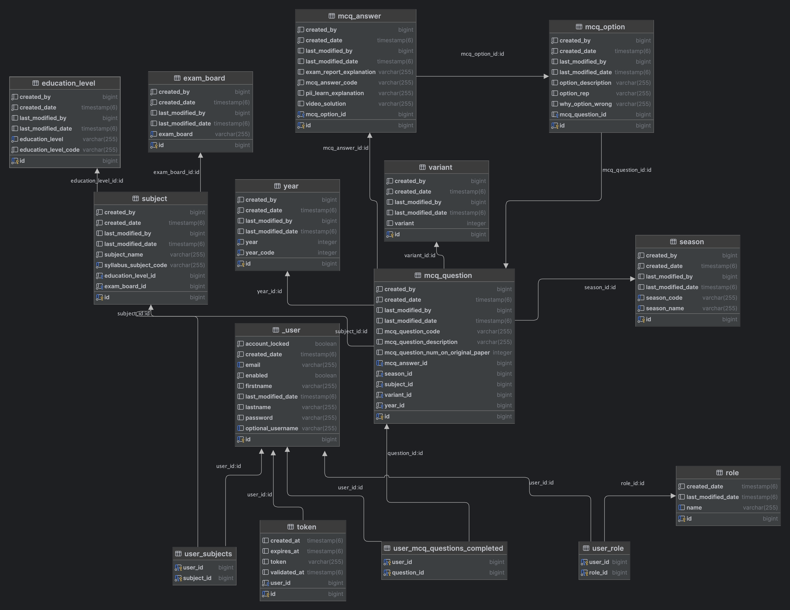
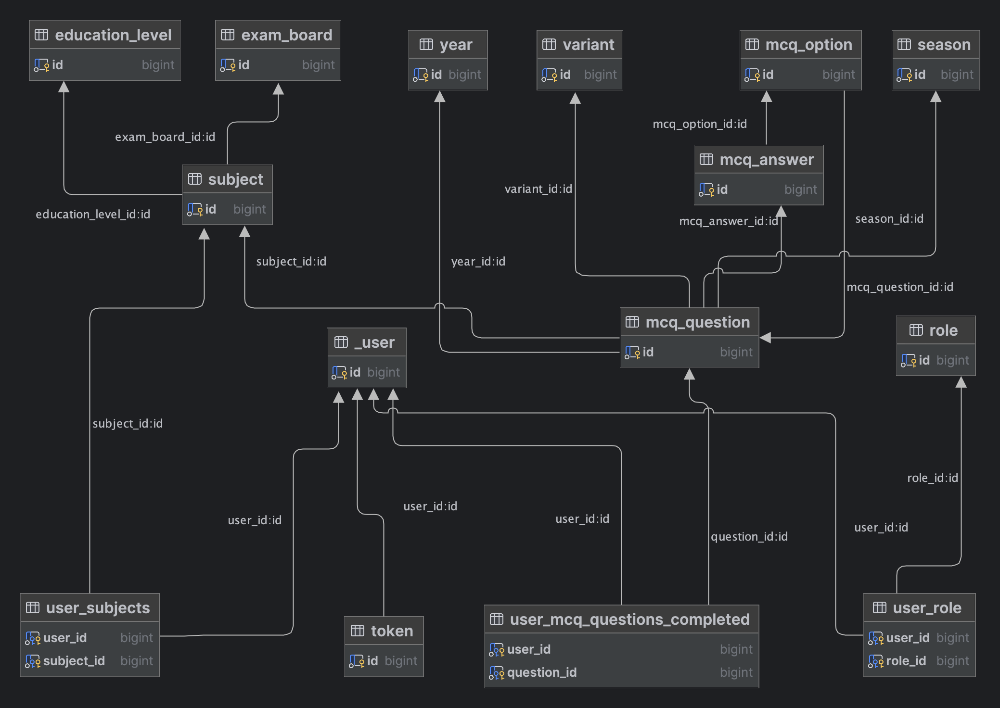

# PiiLearn-backend
***
## Overview 
***
This is the new backend of the project piilearn. A better approach compared with the 
first version ([backend implemented using Django(Python)](https://github.com/eliaschikwanda/pi-learn-1.0)).

## Features
***
- User Registration: Users can register for a new account.
- Email Validation: Accounts are activated using secure email validation codes.
- User Authentication: Existing users can log in to their accounts securely.
- Email or Username Authentication: Users can either use an email or username to authenticate.
- Question Management Dashboard: The dashboard allows the creation, updating, and deletion of McqQuestions, McqOptions.
- Question Comments: User can comment on a question.
- Question Notes: Users can add private notes or public notes to a question.
- Progress Statistic: Users can get a visual representation of their activity statistics like 
the number of questions completed, acceptance rate (they percentage they get on first try) just to mention a few.
### PiiLearn Database class diagram

### PiiLearn Database key diagram

## Technologies Used
***
### Backend (piilearn-backend) *(Code available upon request)*
- Spring Boot 3
- Spring Security 6
- JWT Token Authentication
- Spring Data JPA
- Postgres Database
- Grafana *(Data visualization)*
- Cypress *(UI testing)*
- Selenium *(API testing)*
- Lombok *(Reduce Boiler Plate Code)*
- OpenAPI and Swagger UI Documentation
- Docker
- GitHub Actions
- KeyCloak

### Fronted ([piilearn-frontend](https://github.com/eliaschikwanda/piilearn-web-frontend))
- Angular
- OpenApi Generator for Angular *(Reduce work when writing frontend services)*
- Bootstrap

### Contributors
***
- [Elias Chikwanda](https://github.com/eliaschikwanda)

### Acknowledgements
***
Special thanks to all developers who contributed to the development and deployment of this project.

